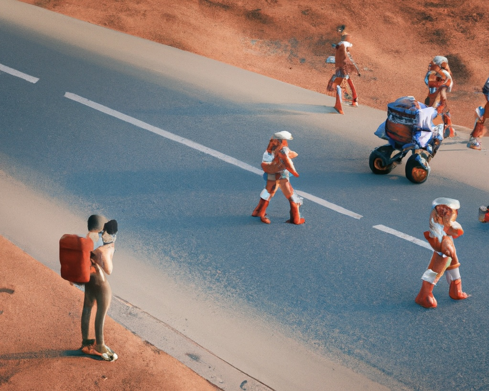

### Hi there 👋

I am a computational social scientist trainee who is interested in human behaviors 💩, human-AI systems 🧍‍♂️🧍‍♀️🤖️, and social inequality 🌟 

- 🧐 I’m currently working on online toxicity in some subreddits 🤫
- 🌱 Currently learning large language models and reinforcement learning. Bankrupted because of overusing GPUs 😭 
- 🎓 M.A. in Computational Social Science at the University of Chicago. GPA 3.93/4.0
- 📚  Reading *A Brief History of Tomorrow*
- 😄 Pronouns: He/Him/His
- ⚡ Fun fact: Street photography enthusiast, and ex-kayaker :0

Generated by DALL·E 2 with prompt “A young computational social scientist is taking photos of pedestrians on a street on Mars”. 

Sorry, I don’t have many repos now and many are private :(   Walk around on GitHub and come back later! 
