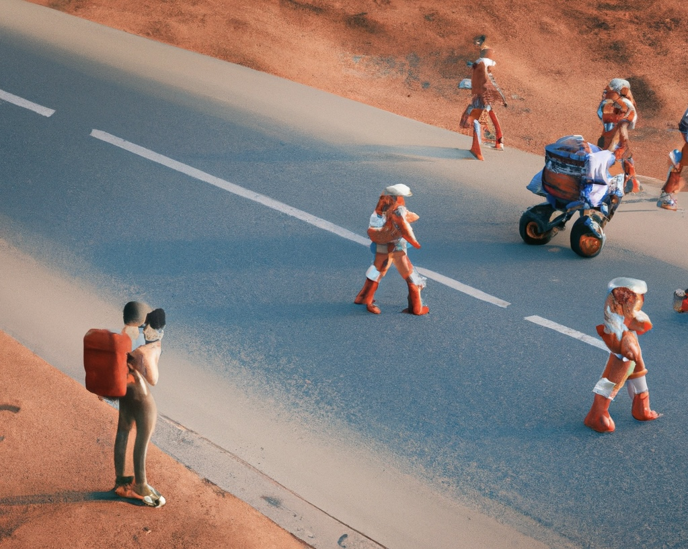

### Hi there 👋

I am a computational social scientist trainee who is interested in human behaviors (mainly focus on polarization) 💩, human-AI systems 🧍‍♂️🧍‍♀️🤖️, and social inequality 🌟 

- 🧐 I’m currently working on online toxicity in some subreddits 🤫
- 🌱 Currently learning large language models and reinforcement learning. Bankrupted because of overusing GPUs 😭 
- 🎓 M.A. in Computational Social Science at the University of Chicago. GPA 3.93/4.0
- 📚  Reading *A Brief History of Tomorrow*
- 😄 Pronouns: He/Him/His
- ⚡ Fun fact: Street photography enthusiast, and former kayaker :0

Generated by DALL·E 2 with prompt “A young computational social scientist is taking photos of pedestrians on a street on Mars”. 

Some projects I did include [puns detection task for GPT-3 models](https://github.com/Hongkai040/BIG-bench-35200-hongkai/tree/puns_json_task/bigbench/benchmark_tasks/puns_detection), [Negative Sentiment Shift on a Chinese Movie-rating Website](https://github.com/Hongkai040/Negative_Sentiment_Shift_in_Online_Community), [LLM sparsification experiments](https://github.com/Hongkai040/llm-sparsification-hongkai), large-scale parallel computing for gender disparity in movie comments, [Multi-modal analysis of gender disparity in movies](https://github.com/Hongkai040/Thinking_with_DL_Final), etc. Feel free to check out!

 

Sorry, I don’t have many repos now and many are private :( I will make some of them public soon!   Walk around on GitHub and come back later! 
